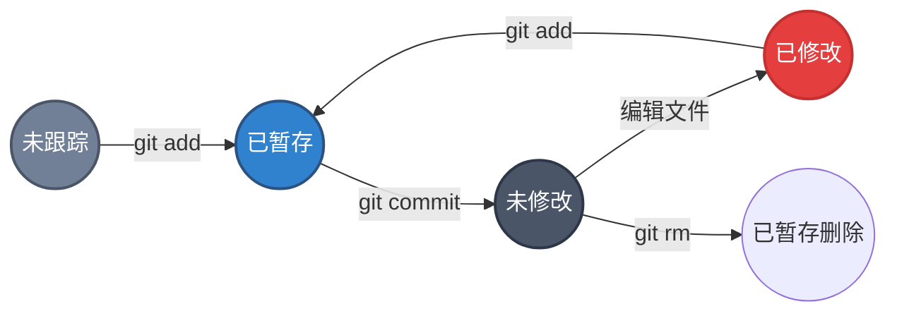

你现在已经拥有了一个真正的 Git 仓库，并从其中检出了文件的某个版本。接下来，你需要对这些文件做些修改，在完成一个阶段的目标后，提交本次更新到仓库。

在开始操作之前，彻底理解 Git 如何管理文件的状态是至关重要的。这是 Git 学习曲线中最陡峭的一段，但一旦掌握，你将如鱼得水。

## 文件的生命周期

工作目录下的每一个文件都不外乎这两种状态：**已跟踪（Tracked）** 或 **未跟踪（Untracked）**。

- **已跟踪（Tracked）**：指那些 Git 已经知道的文件（已提交或已暂存）。它们又可以分为三种子状态：
    - **未修改（Unmodified）**：自上次提交后未曾改动。
    - **已修改（Modified）**：自上次提交后被修改了，但还没放到暂存区。
    - **已暂存（Staged）**：修改已放入暂存区，准备下次提交。
- **未跟踪（Untracked）**：Git 尚未管理的任何文件（既没有在上次提交中，也没有在暂存区中）。

下图展示了文件的生命周期流转：



## 核心概念：三个区域

理解了状态，我们再来看看这些状态对应的物理/逻辑区域。这是 Git 最核心的设计之一。

1.  **工作区 (Working Directory)**：
    就是你在电脑文件资源管理器里能看到的目录。你在这里编辑代码、修改文件。这里是“现实世界”。

2.  **暂存区 (Staging Area / Index)**：
    这是一个逻辑区域（实际上是 `.git` 目录下的一个文件）。**这是 Git 最让新手困惑的地方**。
    
    :::tip[通俗比喻：购物车 vs 收银台]
    想象你在网上购物：
    - **工作区**就像是**商品货架**。你可以随时把商品（文件）拿下来看，也可以放回去，或者弄坏它。
    - **暂存区**就像是**购物车**。当你决定要买某件商品时，你会把它放入购物车（`git add`）。你可以往购物车里放很多商品，也可以拿出来。
    - **仓库**就像是**生成的订单**。当你点击“结算”时（`git commit`），购物车里的所有东西会生成一张永久的订单记录。
    :::

    :::tip[关于移除文件]
    使用 `git rm <file>` 会将文件从 Git 中移除并**删除物理文件**。删除操作会自动进入暂存区（`git status` 显示 `deleted:` 且位于 `Changes to be committed`），提交后该文件即从版本库中移除。
    如果你想从 Git 中移除但**保留物理文件**（比如误提交了配置文件），请使用：
    `git rm --cached <file>`
    执行后你会同时看到 `deleted:`（已暂存的删除）和 `??`（未跟踪副本），提交后文件才会稳定为 **Untracked** 状态。
    :::

    或者用**照相**来比喻：
    - **工作区**：大家在自由活动。
    - **暂存区**：摄影师说“来，大家站好位置，整理表情”，大家走上**舞台**摆好姿势（Stage 也有舞台的意思）。
    - **仓库**：摄影师按下快门，**照片**（Snapshot）生成并存入相册。

3.  **仓库 (Repository)**：
    `.git` 目录，用于存储项目的元数据和对象数据库。

## 检查当前文件状态

要查看哪些文件处于什么状态，主要的工具是 `git status` 命令。

### 1. 干净的工作区

如果你的工作区所有文件都已提交，且没有新文件，运行 `git status` 会看到：

```bash
$ git status
```

```git frame=terminal
On branch main
nothing to commit, working tree clean
```
这意味着目前很“干净”，没有东西需要 Git 操心。

### 2. 发现新文件 (Untracked)

如果你创建了一个新文件 `README.md`，它首先是**未跟踪**的：

```bash
$ echo "My Project" > README.md
$ git status
```

```git frame=terminal
On branch main
Untracked files:
  (use "git add <file>..." to include in what will be committed)
    README.md

nothing added to commit but untracked files present (use "git add" to track)
```
Git 明确告诉你 `README.md` 是 `Untracked files`。除非你显式告诉 Git，否则它不会把这个文件纳入版本控制。

### 3. 已暂存状态 (Staged)

如果你运行 `git add README.md`，此时文件就进入了**暂存区**：

```bash
$ git add README.md
$ git status
```

```git frame=terminal
On branch main
Changes to be committed:
  (use "git restore --staged <file>..." to unstage)
    new file:   README.md
```
`Changes to be committed` 下的文件，就是如果你现在运行 `git commit`，会被记录到历史中的内容。

### 4. 已修改状态 (Modified)

假设你还有一个叫 `CONTRIBUTING.md` 的文件之前已经被跟踪了，现在你修改了它：

```bash
$ git status
```

```git frame=terminal
On branch main
Changes not staged for commit:
  (use "git add <file>..." to update what will be committed)
  (use "git restore <file>..." to discard changes in working directory)
    modified:   CONTRIBUTING.md
```
`Changes not staged for commit` 说明文件被修改了，但还没有放入暂存区（还没有上舞台/放入购物车）。如果现在提交，这个修改**不会**被记录。

## 状态简览 (`git status -s`)

当文件变多时，`git status` 的输出会非常长。Git 提供了一个紧凑的格式：

```bash
$ git status -s
```

```git frame=terminal
 M README.md
MM Rakefile
A  lib/git.rb
M  lib/simplegit.rb
?? LICENSE.txt
```

这里的输出分为两列（左列和右列），含义如下：

| 符号 | 含义 |
| :--- | :--- |
| `??` | **新文件**，未跟踪 (Untracked) |
| `A ` | **新文件**，已暂存 (Added to Staging) |
| ` M` | **已修改**，未暂存 (Modified in Working Dir) |
| `M ` | **已修改**，已暂存 (Modified in Staging) |
| `MM` | **由你来猜？** |

**关于 `MM` 的解释**：
这意味着该文件在工作区被修改并暂存了（左边的 `M`），然后**又**在工作区被修改了（右边的 `M`）。
这在实际开发中很常见：你写了一半代码觉得不错，先 `git add` 了一下（存个档），然后继续写，还没再次 `add`。此时这个文件既有已暂存的内容，也有未暂存的内容。

:::note[小结]
学会随时运行 `git status` 是养成良好 Git 习惯的第一步。在你执行任何提交或复杂操作前，先看一眼状态，能避免 90% 的错误。
:::
