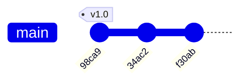
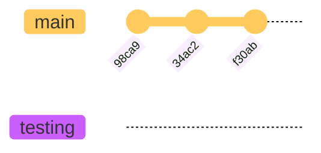
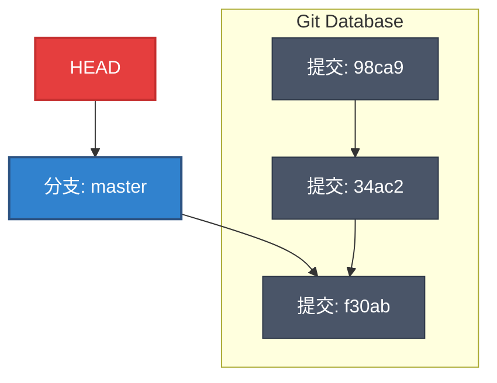

几乎每一种版本控制系统（VCS）都以某种形式支持分支。但在 Git 中，**分支（Branching）** 处理起来极其轻量且难以置信地快速，这使得它成为 Git 最强大的功能之一，也被称为“杀手级特性”。

为了真正理解分支，我们需要先回顾一下 Git 是如何存储数据的。

## Git 存储模型回顾

在上一章我们提到，Git 保存的不是文件的变化量（差异），而是一系列的**文件快照**。

当你执行 `git commit` 时，Git 会创建一个 **Commit 对象**（提交对象），该对象包含：
1.  **元数据**：作者姓名、邮箱、提交信息、时间戳。
2.  **树指针**：指向一个树对象（Tree Object），该树对象代表了当前项目快照的目录结构。
3.  **父指针**：指向前一个提交（Parent Commit）。普通提交有一个父指针，合并提交（Merge）可能有多个，初始提交没有父指针。

我们可以把提交历史想象成一条链表：

## 分支的本质：轻量级指针

在理解了提交对象后，**Git 的分支到底是什么？**

:::note[核心概念]
Git 的分支，本质上仅仅是指向提交对象的可变**指针**。
:::

没错，它不是文件的物理副本，也不是什么复杂的容器。它只是一个包含 40 个字符（SHA-1 哈希值）的简单文件。

### 可视化演示

假设我们的仓库有三个提交。默认情况下，Git 会创建一个名为 `master`（或 `main`）的分支，它指向最后一次提交。

当我们创建一个新分支 `testing` 时，Git 做了什么？它只是创建了一个新的指针，指向当前的提交。

在底层文件系统中，创建分支的操作几乎是瞬间完成的，因为这等同于往一个文件中写入 41 个字节（40 个字符的哈希 + 1 个换行符）。

## HEAD：当前在哪里？

既然现在有两个分支（`master` 和 `testing`）都指向同一个提交，Git 怎么知道你当前在哪个分支上工作呢？

这就引入了 **HEAD** 的概念。

HEAD 是一个特殊的指针，它通常指向**当前所在本地分支**。可以将它理解为“当前检出（Checkout）的分支”。

*   如果 HEAD 指向 `master`，那么你就在 master 分支上。
*   如果 HEAD 指向 `testing`，那么你就在 testing 分支上。

:::note[Detached HEAD (游离状态)]
虽然 HEAD 通常指向分支，但你也可以让它直接指向某个 **Commit**（例如 `git checkout <commit-hash>`）。
这种状态称为 **Detached HEAD**（头指针游离）。此时你不在任何分支上，新的提交如果不建立新分支引用，可能会丢失。
:::

当你执行 `git switch testing` 或 `git checkout testing` 时，Git 只需要把 HEAD 指针从 `master` 移到 `testing` 即可。

## 关于 master 和 main

Git 用户最熟悉的分支名莫过于 `master`。

*   **`master` 分支有什么特殊之处吗？**
    *   **没有**。它与其他任何分支完全一样。
*   **为什么它叫 master？**
    *   仅仅是因为 `git init` 命令默认创建它。大多数人懒得改名，所以它就一直存在。
*   **main 是什么？**
    *   近年来，由于社区倡导更包容的术语，许多平台（如 GitHub）和新版 Git 将默认分支名改为了 `main`。它们在功能上没有任何区别。

## Git 分支 vs 其他 VCS 分支

为了体会 Git 分支的优越性，我们来看看早期的版本控制系统（如 SVN）是如何处理分支的。

| 特性 | SVN / 老式 VCS | Git |
| :--- | :--- | :--- |
| **创建分支方式** | 复制整个项目的目录到新位置 | 创建一个指向提交的 41 字节文件 |
| **创建速度** | 慢（取决于项目文件大小） | **瞬间** |
| **存储空间** | 占用大量额外空间（文件冗余） | 几乎不占用空间 |
| **切换分支** | 慢 | 快 |

这种差异导致了工作流的根本改变：
*   在 **SVN** 中，分支是昂贵的，开发者通常很久才创建一个分支。
*   在 **Git** 中，分支是极其廉价的。因此，Git 鼓励**频繁使用分支**：为一个新功能创建一个分支，甚至为了修复一个微小的拼写错误也可以创建一个分支，用完即删。

## 总结

1.  Git 提交包含指向快照的指针。
2.  **分支**仅仅是指向某个提交的**轻量级指针**。
3.  **HEAD** 是指向当前所在分支的指针。
4.  由于其轻量特性，Git 鼓励频繁、快速地建立和销毁分支。

在下一节中，我们将学习如何通过命令来实际操作这些指针。
