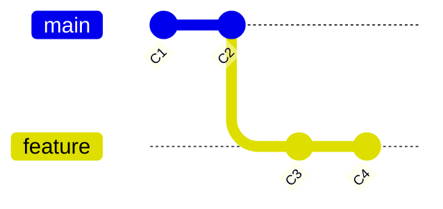
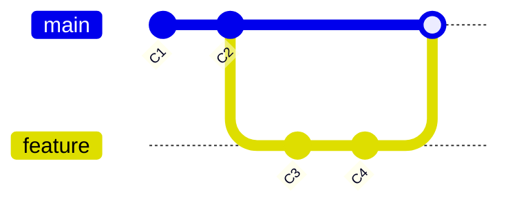
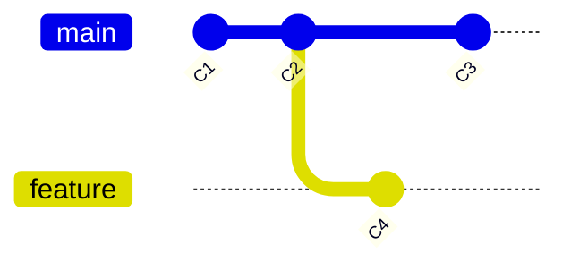
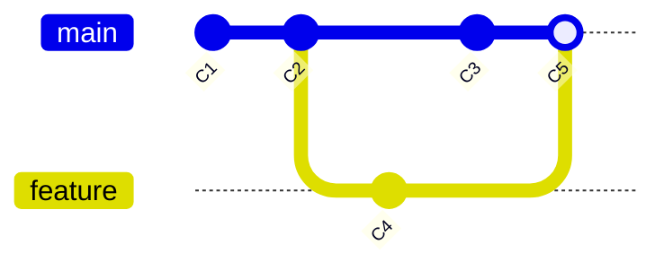

在 Git 中，将一个分支的更改整合到另一个分支，最常用的方法就是 `git merge`。根据分支历史的结构不同，Git 会自动选择不同的合并策略。

本章将深入讲解两种最基础且最常见的合并机制：**Fast-forward (快进)** 和 **3-way Merge (三方合并)**。

## 1. 快进合并 (Fast-forward)

### 什么是 Fast-forward？

当你想把 `feature` 分支合并到 `main` 分支时，如果 `main` 分支在 `feature` 分支创建之后**没有发生过任何更改**（即 `feature` 的提交历史是 `main` 的直接延续），Git 就会执行 **Fast-forward** 合并。

在这种情况下，Git 不需要创建一个新的 "Merge Commit"。它只需要简单地将 `main` 分支的指针**向前移动**到 `feature` 分支的位置即可。

### 视觉演示

**合并前：** `main` 指向 C2，`feature` 基于 C2 继续前进了 C3, C4。



**执行 Fast-forward 合并后：** `main` 直接“快进”到了 C4。



### 实际操作

```bash
# 1. 切换到接收更改的分支 (例如 main)
git checkout main

# 2. 合并 feature 分支
git merge feature
```

**CLI 输出示例：**

```git frame=terminal
Updating 3a1b2c..8d9e0f
Fast-forward
 file1.txt | 2 ++
 1 file changed, 2 insertions(+)
```

:::note[特点]
*   **速度快**：只是移动指针，没有文件内容的算术运算。
*   **线性历史**：合并后，历史记录看起来像是一条直线，看不出这里曾经有过分支。
:::

---

## 2. 三方合并 (3-way Merge)

### 什么是 3-way Merge？

如果自 `feature` 分支创建以来，`main` 分支**也产生了新的提交**，那么两者的历史就发生了**分叉 (Diverged)**。此时，Git 无法简单地移动指针，因为 `main` 的最新提交并不在 `feature` 的历史路径上。

在这种情况下，Git 必须执行 **3-way Merge (三方合并)**。

### 为什么要叫 "3-way"？

Git 会使用三个提交快照来进行合并计算：
1.  **Current Commit**: 当前分支的末端（例如 `main` 的最新提交）。
2.  **Target Commit**: 试图合并进来的分支末端（例如 `feature` 的最新提交）。
3.  **Common Ancestor**: 两个分支分叉处的**共同祖先**提交。

Git 会对比这三者，自动将差异整合，并创建一个新的 **Merge Commit**（合并提交）。这个提交比较特殊，它有**两个父节点**。

### 视觉演示

**合并前：** 历史分叉了。`main` 前进了 C3，`feature` 前进了 C4。共同祖先是 C2。



**执行 3-way Merge 后：** 生成了新的合并提交 C5。



### 实际操作

命令与 Fast-forward 完全一样，Git 会自动检测并切换策略。

```bash
git checkout main
git merge feature
```

**CLI 输出示例：**
此时 Git 通常会弹出一个默认编辑器让你输入合并提交的信息（默认是 `Merge branch 'feature'`）。

```git frame=terminal
Merge made by the 'ort' strategy.
 file_in_feature.txt | 1 +
 1 file changed, 1 insertion(+)
 create mode 100644 file_in_feature.txt
```

:::note[版本差异]
上述输出中的策略名称可能因 Git 版本不同而有所差异：Git 2.34+ 默认使用 `ort` 策略，旧版本使用 `recursive` 策略（从 Git 2.50.0 开始，`recursive` 已成为 `ort` 的别名）。两者都属于三方合并算法，理解合并原理即可，不必纠结输出细节。
:::

:::tip[为什么需要共同祖先？]
如果没有共同祖先作为基准，Git 就不知道两个分支对于同一行代码是“谁修改了谁”，还是“两人都修改了”。共同祖先提供了**基准状态**，让 Git 能判断出：
*   A 分支没动，B 分支改了 -> 采纳 B。
*   A 分支改了，B 分支没动 -> 采纳 A。
*   A、B 都改了 -> **冲突 (Conflict)**（将在下一章讲解）。
:::

## 3. 强制创建合并提交

有时候，即使满足 Fast-forward 的条件，我们也希望保留“这里曾经有过一个特性分支”的历史记录。这时可以使用 `--no-ff` 参数强制生成一个 Merge Commit。

```bash
git merge --no-ff feature
```

这在团队协作中很有用，因为它可以让历史记录更清晰地展示功能的开发周期。

## 总结

| 特性 | Fast-forward (快进) | 3-way Merge (三方合并) |
| :--- | :--- | :--- |
| **触发条件** | 当前分支（接收方）是被合并分支的祖先（即历史没有分叉） | 分支历史分叉 |
| **是否生成新提交** | **否** (仅移动指针) | **是** (生成 Merge Commit) |
| **历史形态** | 线性，看不出分支痕迹 | 网状，清晰展示合并点 |
| **父节点数量** | N/A (只是指针移动) | 两个父节点 |

下一章，我们将讨论当 Git 无法自动完成三方合并时会发生什么——即**合并冲突**的处理。
