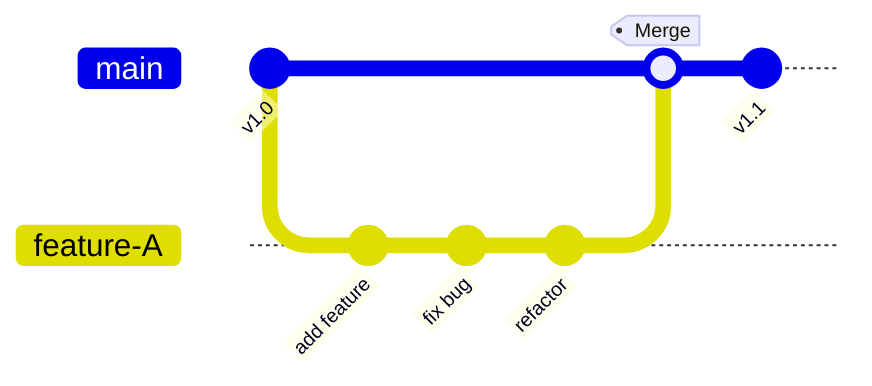

由于 Git 的分支操作非常轻量且快速，使得开发者的工作流与旧的版本控制系统截然不同。在 Git 中，频繁创建、使用和合并分支是家常便饭。本节将介绍两种最基础的分支管理策略，它们是构建复杂工作流的基石。

## 长期分支 (Long-Running Branches)

由于 Git 使用简单的三方合并（Three-way merge），多次从一个分支合并到另一个分支通常都很容易。这意味着你可以拥有几个长期开放的分支，用于不同的开发阶段。

### 稳定性的梯度

许多项目遵循这样的模式，即不同分支代表代码不同程度的**稳定性**：

*   **`main` 分支**：只包含完全稳定的代码，随时可以发布到生产环境。
*   **`develop` 或 `next` 分支**：用于日常开发和集成。这里汇聚了各个开发者的代码，稳定性稍差。
*   **流动方向**：当 `develop` 分支的代码经过测试变稳定后，就会被合并回 `main`。

你可以将这些分支想象成**流水线**或**过滤器**：代码必须经过一系列测试和稳定化过程，才能最终流向 `main`。

:::note[渐进稳定]
并不是所有项目都需要复杂的长期分支结构。对于小型项目，单主分支（Single trunk）往往就足够了。但在大型项目中，这种分层机制能有效防止不稳定代码影响生产环境。
:::

## 主题分支 (Topic Branches)

**主题分支**（Topic Branches）对任何规模的项目都非常有用。它是一个短期的分支，专门用来开发一个特定功能或修复一个 Bug。

*   **特点**：短期存在，用完即删。
*   **目的**：隔离开发干扰。
*   **优势**：通过将工作隔离在单独的分支中，你可以随时切换上下文（例如暂停当前功能去修一个紧急 Bug），而且代码审查（Code Review）也会变得更加清晰，因为该分支只包含与该特定主题相关的修改。

这是 Git 最推崇的模式。在 Git 中，你应该习惯于为每一个新想法创建一个分支。

### 主题分支的可视化演示

下图展示了典型主题分支的生命周期：



这张图清晰地展示了主题分支"用完即删"的核心理念：
1. **切出分支**：从稳定的 `main` 分支创建 `feature-A`
2. **独立开发**：在 `feature-A` 上进行多次提交，与主分支隔离
3. **合并成果**：功能完成后，将 `feature-A` 合并回 `main`
4. **继续前进**：合并后，`feature-A` 的使命完成，可以安全删除，`main` 继续推进

## 示例场景：iss53 的一生

让我们描述一个简单的开发循环，看看主题分支是如何运作的：

1.  **场景开始**：你正在 `main` 分支上工作。
2.  **创建任务**：你决定修复编号为 #53 的问题，于是创建并切换到 `iss53` 分支。
    ```bash
    git checkout -b iss53
    ```
3.  **进行开发**：你进行了一些修改并提交。
    ```bash
    git commit -am "fix: resolved issue 53 logic error"
    ```
4.  **合并成果**：测试通过后，你将 `iss53` 的成果合并回 `main` 分支。
    ```bash
    git checkout main
    git merge iss53
    ```
5.  **清理现场**：既然更改已经合并，`iss53` 分支就不再需要了，将其删除。
    ```bash
    git branch -d iss53
    ```

在这个过程中，`iss53` 就是一个典型的主题分支。它的存在只是为了承载那次特定的修改，一旦使命完成，它就消失了，留下的只有合并后的代码历史。

:::tip
这种模式保证了 `main` 分支始终保持整洁，而开发过程中的尝试、错误和中间状态都被封装在临时的主题分支中。
:::

## 总结

理解了**长期分支**（用于管理稳定性）和**主题分支**（用于管理功能开发）的概念，你就掌握了 Git 分支工作流的核心思想。

在后续的 **07-workflows** 章节中，我们将进一步探讨 Gitflow、GitHub Flow 和 Trunk-based 开发等更具体的企业级策略。
