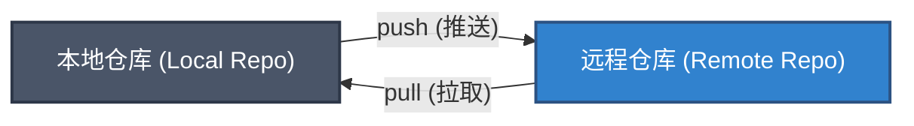

到目前为止，我们所有的操作都是在本地计算机上进行的。Git 的真正强大之处在于其**分布式**特性——你可以与他人协作，将代码备份到服务器，或者在多台设备间同步进度。要实现这些，你需要了解**远程仓库 (Remote Repositories)**。

## 什么是远程仓库？

远程仓库是托管在网络或其他位置的你的项目版本。它可以是你同事的电脑，也可以是像 GitHub、GitLab 或 Gitee 这样的托管服务。

在 Git 中，"远程" (Remote) 实际上只是一个指向远程位置的**别名**或**指针**。



## 查看远程仓库

如果你是克隆 (clone) 了一个现有的仓库，Git 会自动为你添加一个远程仓库。你可以使用 `git remote` 命令查看当前配置的远程仓库。

```bash
# 列出远程仓库的简写名称
git remote

# 列出远程仓库的详细信息 (名称 + URL)
git remote -v
```

**输出示例：**
```text
origin  https://github.com/user/repo.git (fetch)
origin  https://github.com/user/repo.git (push)
```

:::note[什么是 origin?]
你经常会看到 `origin` 这个词。它并没有什么魔法，只是 Git 给克隆来源的默认名称。就像 `master` 或 `main` 是默认分支名一样，`origin` 是默认的远程仓库名。你可以把它改成 `backup`、`upstream` 或任何你喜欢的名字，但保留 `origin` 是约定俗成的习惯。
:::

## 添加远程仓库

如果你是在本地初始化的仓库 (`git init`)，你想把它连接到 GitHub 上新建的空仓库，你需要手动添加远程连接。

**语法：** `git remote add <简写> <url>`

```bash
git remote add origin https://github.com/your-username/your-project.git
```

执行后，再次运行 `git remote -v`，你应该能看到新添加的 `origin`。

## 重命名与移除远程仓库

随着项目的发展，你可能需要管理你的远程连接。

### 重命名远程仓库
例如，将 `origin` 重命名为 `destination`（虽然不推荐改默认名，但了解一下无妨）：

```bash
git remote rename origin destination
```

### 移除远程仓库
如果某个远程仓库不再使用（例如对应的服务器关闭了），你可以解除绑定：

```bash
git remote remove destination
```

:::caution
移除远程仓库连接**不会**删除远程服务器上的代码，它只是删除了你本地仓库中指向该服务器的**配置**和**远程跟踪分支**。
:::

## 总结

- **远程仓库**是代码的异地备份或协作中心。
- 使用 `git remote -v` 查看当前连接。
- 使用 `git remote add <name> <url>` 添加新的连接。
- `origin` 是默认的远程仓库名称。
