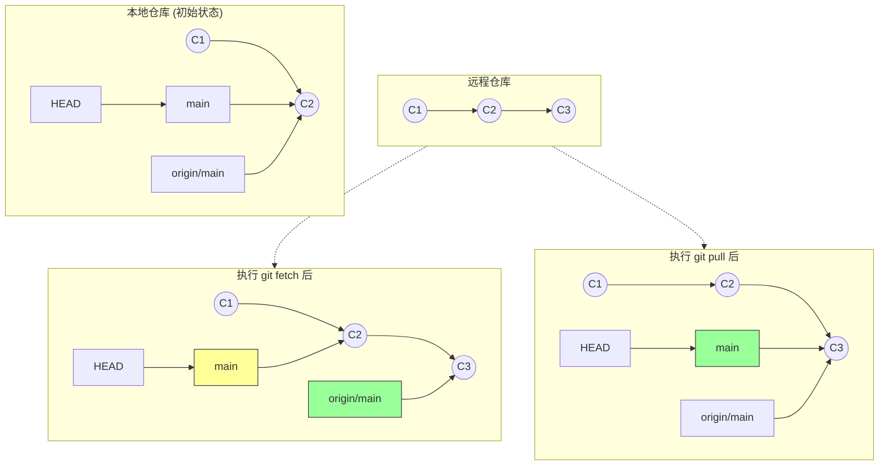

在协作开发中，保持你的本地仓库与远程仓库同步至关重要。Git 提供了两个主要命令来获取远程数据：`git fetch`（抓取）和 `git pull`（拉取）。理解它们的区别是掌握 Git 协作的关键。

## Git Fetch (抓取)

`git fetch` 是一个**安全**的操作。它会下载远程仓库中所有你还没有的数据（提交、文件、引用等），并更新你本地的**远程跟踪分支**（例如 `origin/main`）。

**关键点：** `git fetch` **不会**修改你当前的工作目录或当前分支。它只是把数据下载下来放在一边，让你去查看。

```bash
# 抓取 origin 的所有更新
git fetch origin
```

抓取后，你可以通过 `git log origin/main` 查看远程有了哪些新进展，或者使用 `git diff main origin/main` 来对比差异。

## Git Pull (拉取)

`git pull` 是一个**便捷**命令，它实际上是两个命令的组合：

$$
\text{git pull} = \text{git fetch} + \text{git merge}
$$

当你运行 `git pull` 时，Git 会：
1. 自动从远程下载数据 (`fetch`)。
2. 尝试将远程分支的更改**合并** (`merge`) 到你当前所在的本地分支。

```bash
# 拉取并合并远程 main 分支到当前分支
git pull origin main
```

:::note[使用建议]
对于初学者，`git pull` 非常方便。但随着经验增长，许多开发者更喜欢先 `git fetch` 检查变动，确信无误后再手动 `git merge`，以此避免意外的合并冲突打断工作流。
:::

## 视觉图解：Fetch vs Pull

让我们通过流程图来看清两者的区别。假设远程仓库有了新的提交 `C3`，而你本地还停留在 `C2`。



- **Local_Fetch**: `origin/main` 指针向前移动了，但你的 `main` 指针还在原地。你的工作目录未受影响。
- **Local_Pull**: `origin/main` 移动了，并且你的 `main` 指针也被更新（合并）到了最新位置。

## 总结

- **`git fetch`**: 下载更新，更新远程跟踪分支 (`origin/xxx`)，不影响工作目录。**安全，用于查看。**
- **`git pull`**: 下载更新并尝试合并到当前分支。**方便，用于同步。**
- 如果在 `pull` 时遇到冲突，Git 会停下来让你解决冲突，就像普通的 `merge` 冲突一样。
