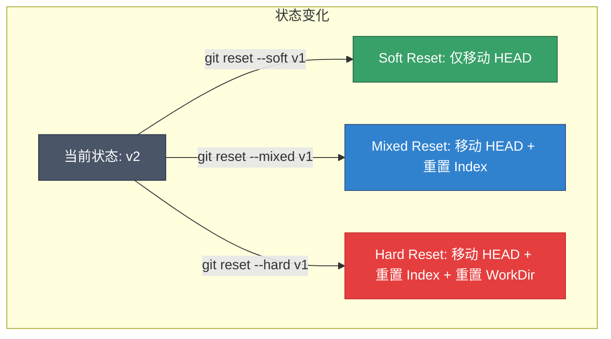

`git reset` 是 Git 中最令人困惑但也最强大的命令之一。很多教程只告诉你“用这个命令撤销提交”，但如果不理解背后的原理，很容易误删代码。

要掌握 `reset`，我们必须先理解 Git 的**三棵树**模型。

## 1. Git 的“三棵树” (The Three Trees)

在 Git 中，“树”指的是文件集合的快照。

| 树 (Tree) | 描述 | 作用 |
| :--- | :--- | :--- |
| **HEAD** | 指向当前分支引用的指针 | 通常指向当前分支名，间接指向最后一次提交。 |
| **Index (暂存区)** | 预期的下一次提交 | `git add` 后的区域，准备生成的快照。 |
| **Working Directory (工作目录)** | 沙盒 | 你在文件系统中实际看到和编辑的文件。 |

当你运行 `git commit` 时，Git 实际上是把 **Index** 的状态保存为一个永久的快照，并更新 **HEAD** 指向它。

## 2. Reset 的两种形式

`git reset` 有两种截然不同的使用形式，理解这一点非常重要：

### 2.1 提交级别的 Reset（移动 HEAD）

当不指定路径时，`reset` 会**移动 HEAD 指针**到指定的提交：

```bash
git reset [--soft | --mixed | --hard] <commit>
```

### 2.2 文件级别的 Reset（不移动 HEAD）

当指定路径时，`reset` **不会移动 HEAD**，只会用指定提交中的文件内容更新暂存区：

```bash
git reset <commit> -- <file>
# 例如：git reset HEAD -- src/app.js
```

这种用法常用于取消暂存（unstage），等价于 `git restore --staged <file>`（Git 2.23+）。

---

## 3. 三种模式详解（提交级别）

以下讨论的是**提交级别**的 `reset`。假设我们要撤销最近的一次提交（回到 `v1` 状态）：

### 3.1 Soft Reset (`--soft`)

```bash
git reset --soft HEAD~1
```

- **HEAD**: 移动到上一个提交。
- **Index**: **不变**（保留了原先 commit 的内容）。
- **Working Directory**: **不变**。

**结果**：你刚刚提交的改动回到了**暂存区**（Staged）。
**场景**：你提交了代码，但想撤销提交动作，保留代码并重新 commit（比如为了合并多个 commit）。

### 3.2 Mixed Reset (`--mixed`) —— **默认模式**

```bash
git reset HEAD~1
# 等同于 git reset --mixed HEAD~1
```

- **HEAD**: 移动到上一个提交。
- **Index**: **重置**（同步为 HEAD 的内容）。
- **Working Directory**: **不变**。

**结果**：你提交的改动回到了**工作目录**，并且是**未暂存**（Unstaged）的状态。
**场景**：你想完全撤销 commit 和 add 操作，重新在这个文件上工作。

### 3.3 Hard Reset (`--hard`)

:::danger[高危操作]
此操作会永久删除**被追踪文件**的未提交改动！
:::

```bash
git reset --hard HEAD~1
```

- **HEAD**: 移动到上一个提交。
- **Index**: **重置**。
- **Working Directory**: **重置**（仅限被追踪文件）。

**结果**：回到上一个提交的状态。你在该提交之后对**被追踪文件**的修改会丢失。
**场景**：彻底放弃当前的乱七八糟的改动，重头再来。

:::note[未追踪文件不受影响]
`--hard` 只会重置被 Git 追踪的文件。新创建但未 `git add` 的文件（untracked files）不会被删除。如果你想清理未追踪文件，需要使用 `git clean -fd`。
:::

:::tip[并不总是完全丢失]
对于已经 Commit 过的历史，如果你误用了 Hard Reset，通常可以通过 `git reflog` 找回那个 Commit 的哈希值并恢复。
但是，**未提交的工作目录修改**（Unstaged changes）一旦 Hard Reset，就真的找不回来了。
:::

## 4. 可视化流程

下面的流程图展示了 `reset` 如何影响这三个区域。假设我们处于 Commit v2，想退回 v1。



### 详细对比表

| 命令 | 移动 HEAD? | 更新 Index? | 更新工作目录? | 你的改动去哪了? |
| :--- | :---: | :---: | :---: | :--- |
| `--soft` | ✅ | ❌ | ❌ | **暂存区 (Staged)** |
| `--mixed` | ✅ | ✅ | ❌ | **工作目录 (Unstaged)** |
| `--hard` | ✅ | ✅ | ✅ | **被追踪文件的修改消失** |

## 5. 使用 Reflog 恢复误删的提交

如果你不小心 `reset --hard` 到了错误的提交，别慌！只要该提交曾经存在过，就可以通过 `reflog` 找回。

### 恢复流程

```bash
# 1. 查看 HEAD 的移动历史
git reflog

# 输出示例：
# 3a1b2c (HEAD -> main) HEAD@{0}: reset: moving to HEAD~3
# 9d8e7f HEAD@{1}: commit: feat: add user auth
# ...

# 2. 找到你想恢复的提交哈希（如 9d8e7f）
# 3. 恢复到该提交
git reset --hard 9d8e7f
```

:::caution[Reflog 的边界]
- Reflog 是**本地**的，不会推送到远程。
- Reflog 条目有过期时间（默认 90 天），过期后会被垃圾回收清理。
- 未提交的工作目录修改无法通过 reflog 恢复——它只记录 HEAD 的移动历史。
:::

## 6. 总结

- 想撤销 commit 但保留代码继续提交？用 `--soft`。
- 想撤销 commit 和 add，把代码打回原形继续修改？用 `--mixed`（默认）。
- 当前改动太乱想彻底重来？用 `--hard`（**慎用**）。

理解了“三棵树”，你就掌握了 Git 时间旅行的钥匙。
