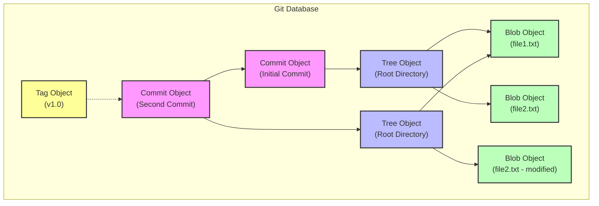

Git 的核心本质是一个 **键值对文件系统 (Content-addressable filesystem)**。当你向 Git 仓库中插入任何类型的内容时，Git 会返回一个唯一的键（Key），你可以通过这个键在任意时刻取回该内容（Value）。

这套机制由四种基本的对象类型支撑：
1. **Blob (二进制大对象)**
2. **Tree (树对象)**
3. **Commit (提交对象)**
4. **Tag (标签对象)**

让我们逐一拆解。

## 1. Blob 对象 (文件内容)

**Blob (Binary Large Object)** 仅存储**文件的数据内容**，不包含文件名、权限或时间戳等元数据。

- 如果你有两个文件 `README.md` 和 `intro.txt`，内容都是 `Hello`，Git 只会存储**一个** Blob 对象。
- 这也是 Git 高效的原因之一：重复的内容在数据库中只占一份空间。

我们可以通过 `git cat-file` 验证这一点：

```bash
# 创建一个包含 "version 1" 的文件
echo "version 1" > test.txt
git hash-object -w test.txt
# 输出: 83baae61804e65cc73a7201a7252750c76066a30
```

## 2. Tree 对象 (目录结构)

既然 Blob 只存内容，那文件名存哪儿了？答案是 **Tree 对象**。

Tree 对象解决了文件名和目录层级的问题。一个 Tree 对象代表了一个目录及其包含的信息。它包含了一系列的记录，每一条记录指向一个 Blob（代表文件）或另一个 Tree（代表子目录）。

一个 Tree 对象的内容看起来像这样：

```text
100644 blob 83baae61804e65cc73a7201a7252750c76066a30    test.txt
040000 tree 0ab42...                                    lib
```

你可以把它想象成操作系统的文件夹，它将文件名映射到对应的 Blob 哈希值。

## 3. Commit 对象 (提交快照)

Tree 对象虽然保存了目录结构，但它不知道是谁保存的、什么时候保存的，以及为什么要保存。**Commit 对象** 解决了这个问题。

Commit 对象存储了：
- **顶级 Tree 对象**的指针（代表项目在该时刻的完整快照）。
- **父提交 (Parent)** 的指针（如果有的话，指向上一次提交）。
- **作者 (Author)** 和 **提交者 (Committer)** 的信息（姓名、邮箱、时间戳）。
- **提交信息 (Message)**。

这解释了为什么 Git 的历史是一条链：每个 Commit 都指向上一个 Commit。

## 4. Tag 对象 (标签)

**Tag 对象** 非常像 Commit 对象，但它通常指向一个 Commit，包含标签的创建者信息、日期、标签信息和 GPG 签名。

它就像是一个永不移动的指针，给某个特定的 Commit 打上永久的标记（如 `v1.0`）。

## 对象关系图解

让我们通过一张图来理清它们的关系：



### 图解说明
1. **Commit** 指向一个 **Tree**。
2. **Tree** 指向具体的 **Blob** 或子 **Tree**。
3. 如果文件 (`file1.txt`) 在两次提交间没有变化，新的 Tree 会直接指向旧的 Blob（复用）。
4. 如果文件 (`file2.txt`) 发生了变化，Git 会创建一个新的 Blob (`B3`)，新的 Tree 指向它。

## 手动探索

你可以在任何 Git 仓库中通过 `git log` 找到一个 Commit 哈希，然后开始顺藤摸瓜：

```bash
# 1. 查看最新的 Commit
git cat-file -p HEAD

# 输出示例:
# tree 5d6e...
# parent ...
# author ...
# committer ...
# message ...

# 2. 拿着上面的 tree 哈希值，查看 Tree 对象
git cat-file -p 5d6e...

# 输出示例:
# 100644 blob 83ba...    README.md
# 040000 tree 0ab4...    src

# 3. 拿着 blob 哈希值，查看文件内容
git cat-file -p 83ba...
```

这就是 Git 的全部奥秘：简单的对象通过哈希指针链接在一起，构成了一个强大、去中心化的版本控制系统。
