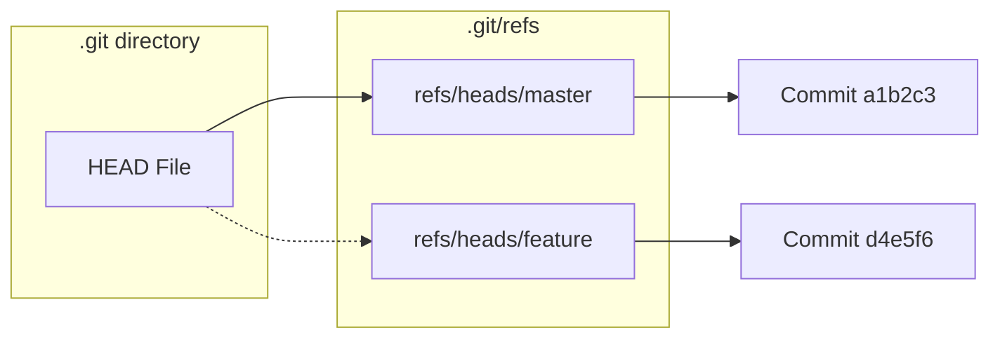

在上一章中，我们了解到 Git 通过哈希值（40位的 SHA-1 字符串）来标识提交。但是，要让用户去记忆 `a042389...` 这样的哈希值简直是噩梦。

这就是 **引用 (References，简称 Refs)** 存在的意义。

引用本质上就是**一个包含 SHA-1 哈希值的简单文本文件**。它们给枯燥的哈希值起了好记的名字，比如 `master`、`main` 或 `v1.0`。

## 引用的存储位置

所有的引用都存储在 `.git/refs` 目录下。我们可以通过文件系统直接查看它们。

```bash
ls -F .git/refs/
# 输出可能包含:
# heads/    (存放本地分支)
# tags/     (存放标签)
# remotes/  (存放远程分支)
```

### 1. 分支 (Heads)

当我们执行 `git branch feature` 时，Git 实际上只是在 `.git/refs/heads/` 下创建了一个名为 `feature` 的文件，并将当前 Commit 的哈希值写入其中。

**验证一下：**

```bash
# 查看 master 分支指向的提交
cat .git/refs/heads/master
# 输出: 1a2b3c4d5e... (一个哈希值)

# 验证它是否与 git log 显示的一致
git log -1 --format=%H
```

所以，**Git 的分支非常轻量**。创建一个分支仅仅是写入 41 个字节（40个字符 + 换行符），无论你的项目有几百兆大，创建分支都是瞬间完成的。

### 2. 标签 (Tags)

标签存储在 `.git/refs/tags/` 目录下。
- **轻量标签 (Lightweight Tag)**：就像分支一样，文件内容直接就是 Commit 的哈希值。
- **附注标签 (Annotated Tag)**：文件内容指向的是一个 **Tag 对象**（我们在上一章提到的第四种对象），而不是直接指向 Commit。

### 3. 远程引用 (Remotes)

当你运行 `git push` 或 `git fetch` 时，Git 会更新 `.git/refs/remotes/` 下的文件。
例如，`origin/main` 分支的状态就保存在 `.git/refs/remotes/origin/main` 文件中。

:::caution
虽然你可以手动编辑这些文件来改变分支指向，但强烈建议使用 `git update-ref` 命令来进行安全的操作。
:::

## 特殊引用：HEAD

`HEAD` 是一个非常特殊的引用，它决定了你的工作目录当前处于哪个版本。

如果你查看 `.git/HEAD` 文件，你会发现它通常不包含哈希值，而是指向另一个引用。这被称为 **符号引用 (Symbolic Ref)**。

```bash
cat .git/HEAD
# 输出: ref: refs/heads/master
```

这句话的意思是：“我现在处于 `master` 分支上”。当我们提交代码时，Git 会先解析 `HEAD` 找到 `refs/heads/master`，然后更新 `refs/heads/master` 指向新的 Commit 哈希。

### 分离头指针 (Detached HEAD)

当你检出一个具体的 Commit 哈希（而不是分支名）时：
```bash
git checkout 1a2b3c...
```
`.git/HEAD` 的内容会直接变成该哈希值：
```bash
cat .git/HEAD
# 输出: 1a2b3c...
```
这就叫 **分离头指针** 状态。此时 `HEAD` 不指向任何分支引用，因此新的提交不会更新任何分支，一旦切走，这些提交很容易丢失（被垃圾回收）。

## 引用关系图



## 总结

- **分支** 只是一个指向特定 Commit 的指针文件。
- **HEAD** 是一个指向当前所在分支的指针。
- **切换分支** (`git checkout`) 实际上就是修改 `HEAD` 文件的内容，并更新工作目录的文件。
- **移动分支** (`git reset`) 实际上就是修改 `.git/refs/heads/<branch>` 文件中的哈希值。

理解了 Refs，你就理解了 Git 分支操作的物理本质。
