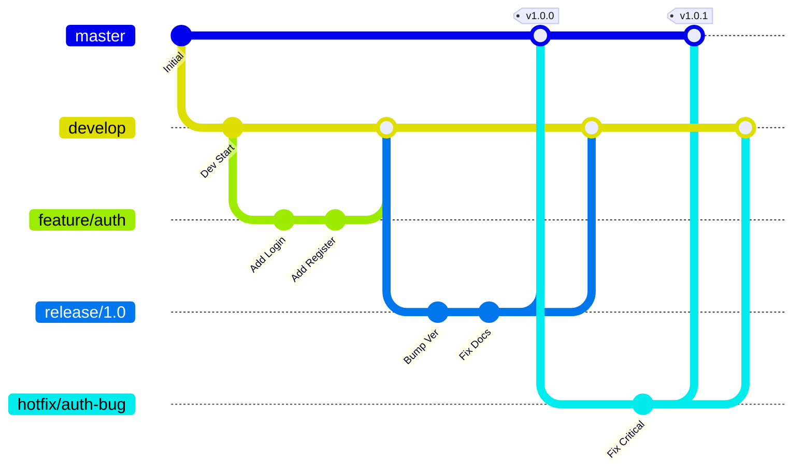

**Gitflow** 是 Vincent Driessen 在 2010 年提出的一种严格的 Git 分支模型。它为管理大型项目提供了一个健壮的框架，特别适合有预定发布周期（Scheduled Release）的项目。

虽然在现代持续交付（CD）环境中它常被认为过于繁琐，但它依然是理解 Git 分支管理的经典教材。

## 核心分支结构

Gitflow 使用两个长期存在的分支来记录项目的历史：

1.  **`master` (或 `main`)**：
    *   存储正式发布的历史。
    *   **原则上时刻保持稳定**，随时可以部署到生产环境。
    *   每次发布对应的提交应打版本标签（例如 `v1.2.0`）。

2.  **`develop`**：
    *   集成的“集散地”。
    *   包含为下一次发布准备的最新开发代码。
    *   通常作为功能分支的切出点和合并目标。

## 辅助分支

除了主分支，Gitflow 使用三种类型的临时分支来支持并行开发，每种分支都有严格的规则：

### 1. 功能分支 (Feature Branches)
*   **用途**：开发新功能。
*   **来源**：`develop`
*   **合并回**：`develop`
*   **命名**：`feature/*` (例如 `feature/login-page`)
*   **生命周期**：功能开发完成后合并回 `develop` 并删除。

### 2. 发布分支 (Release Branches)
*   **用途**：准备新的生产版本（修复 Bug、生成文档、元数据更新）。
*   **来源**：`develop`
*   **合并回**：`master` **和** `develop`
*   **命名**：`release/*` (例如 `release/1.2.0`)
*   **生命周期**：
    1. 当 `develop` 完成了本次发布的所有功能，切出发布分支。
    2. 此时严禁添加新功能，只修 Bug。
    3. 准备好后，合并入 `master`（打 Tag）并合并回 `develop`（同步 Bug 修复）。

### 3. 热修复分支 (Hotfix Branches)
*   **用途**：紧急修复生产环境的严重 Bug。
*   **来源**：`master`
*   **合并回**：`master` **和** `develop`
*   **命名**：`hotfix/*` (例如 `hotfix/1.2.1`)
*   **生命周期**：
    1. 生产环境出问题，直接从 `master` 切出修复。
    2. 修复后，合并回 `master`（打 Tag）和 `develop`。
    3. *注意：若当前有正在准备的 `release/*` 分支，需确保 hotfix 进入该 release；随后也要确保修复最终进入 `develop`。*

## 工作流可视化

下图展示了 Gitflow 各分支的生命周期流向：

## 优缺点分析

### 优点
1.  **清晰的结构**：每个阶段的代码状态一目了然，非常适合管理复杂的版本发布。
2.  **并行开发**：功能开发、版本准备和紧急修复可以同时进行，互不干扰。
3.  **标准化**：严格的规则让团队成员无需思考“该往哪里提交”。

### 缺点
1.  **复杂性**：分支过多，维护成本高，容易出现合并冲突。
2.  **不敏捷**：`develop` 和 `release` 分支的存在推迟了代码上线的时间，不适合“每天部署多次”的 CI/CD 模式。
3.  **长寿分支**：功能分支如果长期不合并，会大幅偏离 `develop`，导致“合并地狱”。

## 何时使用？

*   ✅ **推荐**：
    *   传统的软件产品（如桌面软件、App），有明确的版本号和发布周期。
    *   需要支持旧版本维护的项目。
    *   团队规模较大，需要严格控制发布质量。

*   ❌ **不推荐**：
    *   SaaS 网站或 Web 服务，需要持续部署。
    *   初创团队，追求极速迭代。
    *   **主干开发**通常是这些场景更好的选择。

:::tip[Gitflow 工具]
虽然你可以手动运行 git 命令来执行这些操作，但安装 `git-flow` 扩展工具集可以让操作更简单。例如：`git flow feature start my-feature` 会自动帮你完成切分支、配置等工作。
:::
