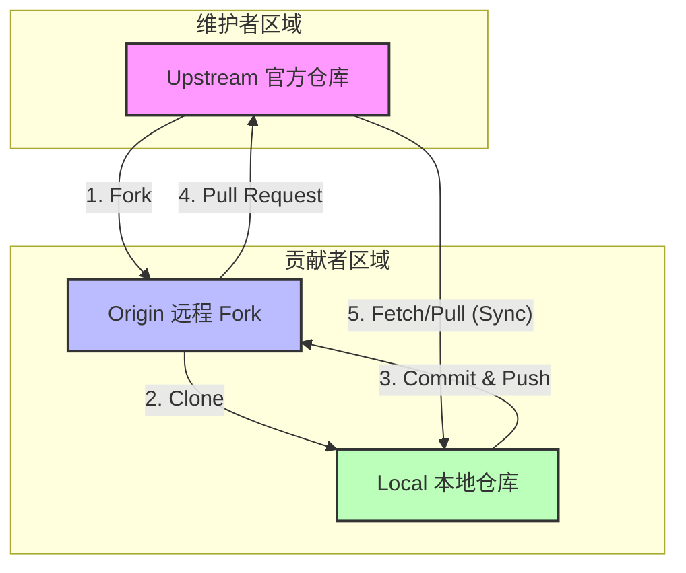

**Forking 工作流** 与其他工作流最大的不同在于：**它不依赖于单一的中央共享仓库**。相反，每个开发者都拥有一个完全独立的服务器端仓库（Fork）。

这种模式是 GitHub、GitLab 等平台的核心协作方式，也是开源项目维护的标准流程。

## 核心概念

在 Forking 工作流中，涉及三个主要角色的仓库：

1.  **Upstream (上游/官方仓库)**：项目的权威版本，通常由项目维护者管理。普通贡献者没有写入权限。
2.  **Origin (你的远程 Fork)**：你从 Upstream 派生（Fork）出来的仓库，位于你的 GitHub 账号下。你有完全的读写权限。
3.  **Local (本地仓库)**：你电脑上的仓库，用于实际写代码。

## 工作流程详解

### 1. Fork (派生)
开发者首先在 GitHub 上点击 "Fork" 按钮，将官方仓库复制一份到自己的账号下。这是一个服务器端的克隆操作。

### 2. Clone (克隆)
将你自己的远程仓库 (`origin`) 克隆到本地。

```bash
git clone https://github.com/your-username/repo.git
```

### 3. 配置 Upstream
为了保持与官方仓库同步，你需要在本地添加一个指向 Upstream 的远程链接。

```bash
git remote add upstream https://github.com/maintainer/repo.git
```

### 4. 开发与推送
你在本地创建分支、修改代码，并推送到**你自己的**远程仓库 (`origin`)。

```bash
git push origin feature/new-idea
```

### 5. Pull Request (发起请求)
在 GitHub 页面上，发起一个 Pull Request (PR)，请求将你的 `feature/new-idea` 分支合并到 `upstream` 的主分支。

### 6. 同步 (Sync)
在开发过程中，`upstream` 可能会更新。你需要定期拉取这些更新到本地，并合并到你的分支，以避免冲突。

```bash
git fetch upstream
git merge upstream/main
```

## 数据流向图

下图展示了典型的“三角形”数据流向：



## 优缺点分析

### 优点
1.  **权限隔离**：贡献者不需要官方仓库的写入权限，维护者可以安全地接受外部贡献。
2.  **保持主库整洁**：所有的半成品代码都待在贡献者自己的仓库里，不会弄脏官方仓库的分支列表。
3.  **团队协作**：即使是公司内部项目，使用 Forking 也能强制实施 Code Review（通过 PR），并防止新人误删主分支。

### 缺点
1.  **同步繁琐**：必须手动配置并定期同步 `upstream`，对于 Git 初学者来说容易混淆 `origin` 和 `upstream`。
2.  **流程较长**：对于极小的修改（如改个错别字），Fork -> Clone -> Push -> PR 的流程显得有些“杀鸡用牛刀”。

## 适用场景

*   **开源项目**：这是唯一可行的方案，允许全球任何人参与贡献。
*   **大型外包团队**：如果你不希望外包人员直接访问核心代码库的写权限。
*   **高安全性项目**：需要严格控制合入权限的敏感项目。

:::caution[同步陷阱]
新手最容易犯的错误是只从自己的 `origin` 拉取代码，而忘记了 `upstream` 才是真正的源头。**始终记住：代码最终要流向 Upstream，也要从 Upstream 流回你的本地。**
:::
